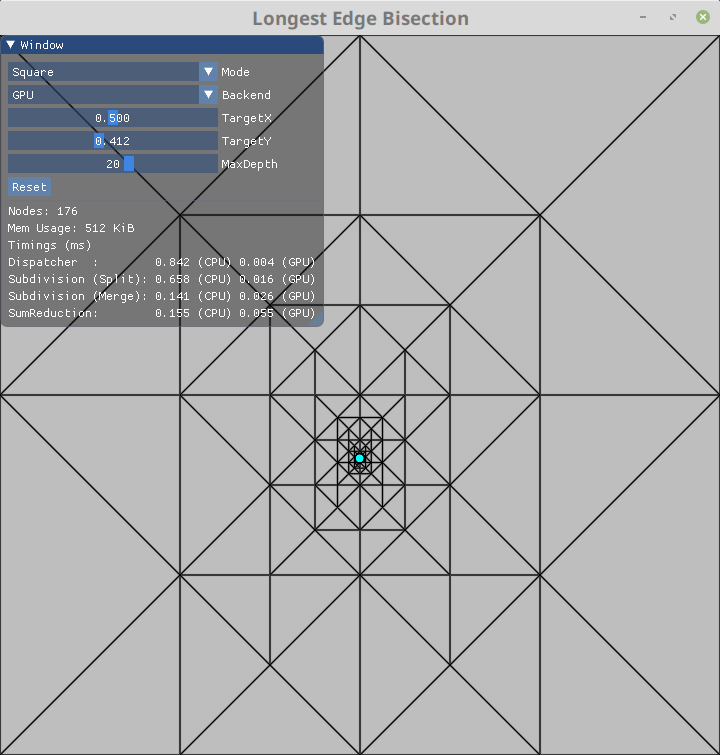

# Longest Edge Bisection 2D

[](https://travis-ci.org/jdupuy/LongestEdgeBisection2D)
[](https://ci.appveyor.com/project/jdupuy/longestedgebisection2d)

This code allows to reproduce some of the results of my paper ["Concurrent Binary Trees (with application to Longest Edge Bisection)"](https://onrendering.com/).
I provide two programs: subdivision, and terrain.

### Subdivision Program
This program provides a basic example to set-up the CBT and LEB library to compute adaptive longest edge bisections in parallel either on the CPU or GPU. The parallel computations are carried out by OpenMP on the CPU, and GLSL on the GPU. Below is a preview of the program.


### Terrain Program
This program provides a terrain renderer based on the adaptive longest edge bisection. The terrain geometry is computed and updated in parallel on the GPU using GLSL shaders. Below is a preview of the program.


### License

Apart from the submodule folder, the code from this repository is released in public domain. You can do anything you want with them. You have no legal obligation to do anything else, although I appreciate attribution.

It is also licensed under the MIT open source license, if you have lawyers who are unhappy with public domain.

### Cloning

Clone the repository and all its submodules using the following command:
```sh
git clone --recursive git@github.com:jdupuy/LongestEdgeBisection2D.git
```

If you accidentally omitted the `--recursive` flag when cloning the repository you can retrieve the submodules like so:
```sh
git submodule update --init --recursive
